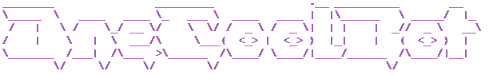

[](https://www.codefactor.io/repository/github/timothypidashev/onecoolbot)
[](https://discord.gg/EDRjZdkGBG)
[](https://pypi.python.org/pypi/discord.py)
[](https://wakatime.com/badge/github/timothypidashev/OneCoolBot)


<!-- A discord bot built using [discord.py](https://github.com/Rapptz/discord.py) for my personal servers.

# Features
* Levelling
* Moderation
* Music
* Colorful Logging
* Basic ai
* Broken Economy

# Usage
***The below usage is curently being simplified and rewritten for ease of use. Please do not use this bot in these stages because of upcoming breaking changes!***

Note: This was the first project I ever started, and as such is cluttered with messy code and buggy features. It is also by no means something you can just grab and use, as most of the codebase and database is made in a way that my servers can benefit from. If you really want to use this bot, a lot of editing and configurations will need to be made in order for the bot to function properly.

If you are crazy enough to consider using this, follow the steps below:
* Make sure to change the `client_token` and `statcord_token` in the configuration file: [config.json](https://github.com/timothypidashev/OneCoolBot/blob/main/config.json). `admin_ids` should also be changed to trusted people only, as this category has access to all admin commands, such as turning off the bot.
```python
{
    "client_token": "insert_discord_token_here",
    "statcord_token": "insert_statcord_token_here",
    "owner_ids": [owner_ids_here_separated_by_commas, owner_id],
    "devthings": [791160100567384094] #rename this to your server name and id
}
```
* Make sure to generate a new database file! Delete **[./data/database.db](https://github.com/timothypidashev/OneCoolBot/blob/database.db)**, and a new database will be generated when the bot is run again.
* Edit the database table `guildsettings` to suit your own needs
<a id="guildsettings"></a>

|             GuildID             |         RoleLevel           |     RoleLevelID       |  LevelCoins                | 
| ------------------------------- | --------------------------- | --------------------- | -------------------------- |
| `guild_id_of_guild_in_context`  |  `level_role_is_awarded_on` |  `Role_id_in_context` |  `coins_awarded_on_levelup`|

Note: column `LevelChannel` is currently not in use, so feel free to put a 0

To use `level_roles`, some changes in **[./utils/levels.py](https://github.com/timothypidashev/OneCoolBot/blob/main/utils/levels.py)** will have to be made.
1. Change the configuration above to your config in config.json:
```python
with open("config.json") as file:
    config = json.load(file)
    devthings = config["devthings"]
```
2. Change when a role is added to match your database config:
```python
async def level_up(self, message, new_lvl):
    async with message.channel.typing():
        await log.level_up(self, message, new_lvl)

        if message.guild.id in config["devthings"]:
            if new_lvl == 5:
                await level_up_process(self, message, new_lvl)

            elif new_lvl == 10:
                await level_up_process(self, message, new_lvl)

            elif new_lvl == 20:
                await level_up_process(self, message, new_lvl)

            elif new_lvl == 30:
                await level_up_process(self, message, new_lvl)

            elif new_lvl == 40:
                await level_up_process(self, message, new_lvl)

            elif new_lvl == 50:
                await level_up_process(self, message, new_lvl)

            elif new_lvl == 75:
                await level_up_process(self, message, new_lvl)
```
3. modify **[./cogs/events.py](https://github.com/timothypidashev/OneCoolBot/blob/main/cogs/events.py)** to match your server
* change the `server_id`
```#DevelopingThings GuildID
devthings_guild_id = (change_to_your_server_name)
```

* change or delete `role_emoji` function:
```python
if emoji == "emoji_name_as_defined_in_your_server":
    role = member.guild.get_role(role_id)
    await member.add_roles(role)
```
* change or delete `join_role`:
```python
@commands.Cog.listener()
async def on_member_join(self, member):
    if member.guild.id == devthings_guild_id:
    
        role = member.guild.get_role(your_role_id)
        await member.add_roles(role)

    else:
        return
```

That's about it for usage. Again I strongly recommend to not use this bot, as it is the worst example of a python project, but feel free to use the code in any way you want! If you like what you see, consider joining my discord server: -->

<!-- # WIP! Join the discord server for updates

[](https://discord.gg/EDRjZdkGBG) -->
